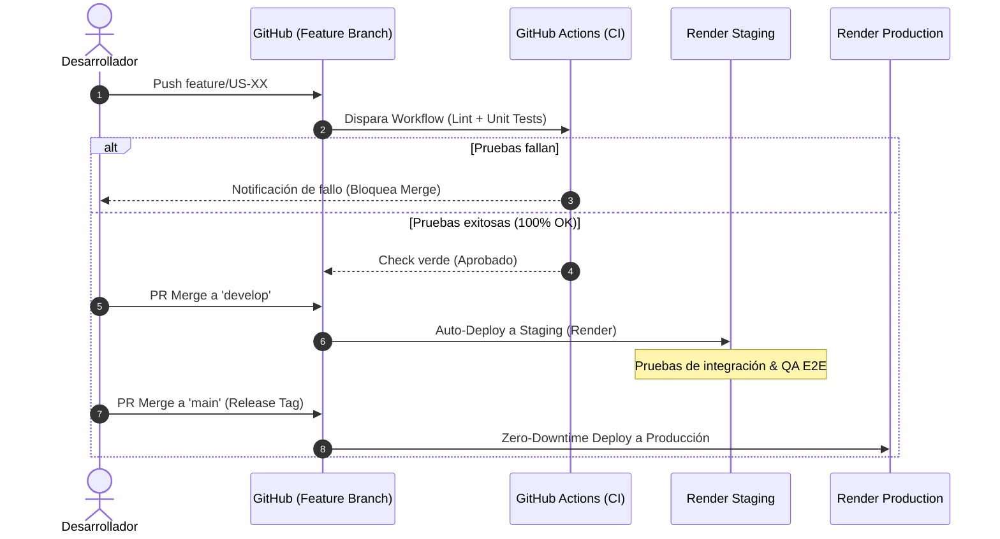
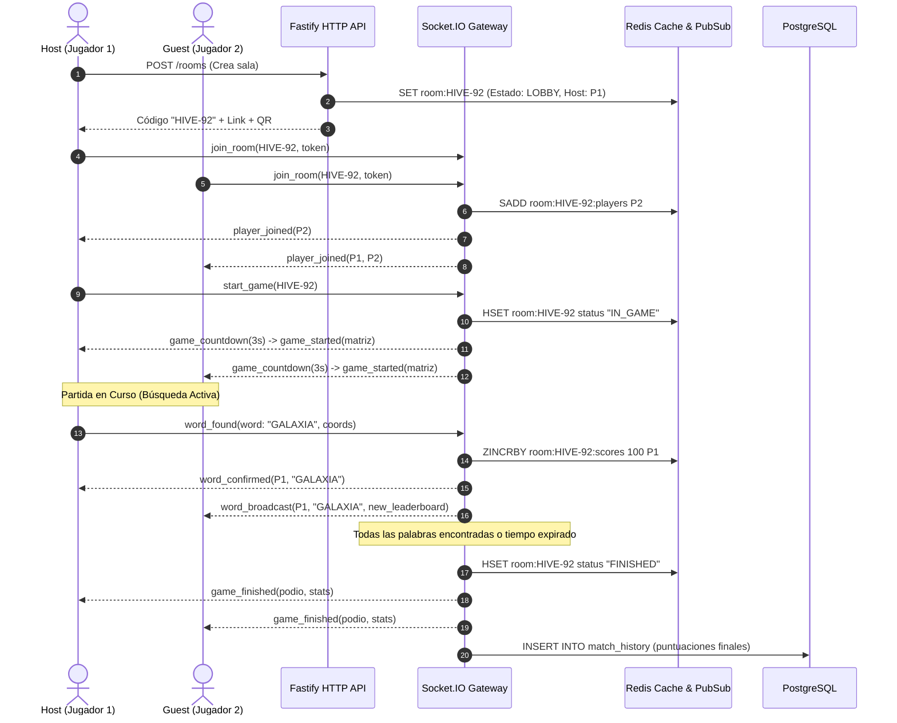

# WordHive — Product Backlog & Implementation Flow

> **Documento:** Product Backlog, User Stories & End-to-End Implementation Workflow  
> **Proyecto:** WordHive (Sopa de Letras Multijugador & Competitiva)  
> **Versión:** 1.0.0  
> **Fecha:** Octubre 2026  
> **Estado:** Aprobado para Ejecución  
> **Referencia Técnica:** [TECHNICAL_DOCUMENT.md](file:///C:/Users/pc/.gemini/antigravity-ide/brain/064efb62-aeec-4141-a464-a847834a0982/TECHNICAL_DOCUMENT.md)  
> **Reglas de Agente:** [AGENT.md](file:///c:/Users/pc/Desktop/sopa-de-letras/.agents/AGENT.md)

---

## 1. Marco Metodológico y Criterios de Gestión

### 1.1 Metodología de Estimación y Priorización
- **Story Points (SP):** Secuencia de Fibonacci adaptada (`1, 2, 3, 5, 8, 13, 21`).
  - `1 - 2 SP`: Tarea simple, UI estática, endpoint CRUD sin lógica compleja.
  - `3 - 5 SP`: Lógica de negocio moderada, componentes con estado, integración REST.
  - `8 - 13 SP`: Lógica compleja (algoritmo generador de matriz, WebSocket multijugador, gestión de salas distribuidas).
  - `21 SP`: Épica o historia compuesta que requiere desglose obligatorio antes de iniciar sprint.
- **Priorización MoSCoW:**
  - **Must Have (M):** Crítico para el funcionamiento mínimo y flujo troncal (Core Loop).
  - **Should Have (S):** Altamente deseable, aporta valor competitivo diferencial.
  - **Could Have (C):** Deseable si el tiempo y capacidad lo permiten (mejoras estéticas, micro-animaciones adicionales).
  - **Won't Have this time (W):** Reservado para versiones posteriores (v2.0).

### 1.2 Definición de Preparado (Definition of Ready - DoR)
Una Historia de Usuario está lista para entrar a Sprint si:
1. El requerimiento de negocio está claro y no presenta ambigüedades.
2. Posee Criterios de Aceptación en formato Given-When-Then (Gherkin).
3. Tiene identificadas las capas de Clean Architecture a modificar (`Domain`, `Application`, `Infrastructure`, `Presentation`).
4. Las dependencias entre servicios o contratos de API (Swagger/OpenAPI schemas) están predefinidas.
5. El diseño visual o wireframe UX está aprobado y cuenta con paleta de colores/tokens accesibles.
6. Ha sido estimada por el equipo de desarrollo.

### 1.3 Definición de Terminado (Definition of Done - DoD)
Una Historia de Usuario se considera completada únicamente si:
1. **Código:** Cumple los principios Clean Architecture y las directivas de modularidad de `AGENT.md` (archivos concisos, responsabilidad única).
2. **Pruebas:** Pruebas unitarias de casos de uso y entidades con cobertura $\ge 80\%$.
3. **Linter & Formato:** Pasa `npm run lint` / `flutter analyze` con cero errores y advertencias críticas.
4. **Validación:** Probada en entorno local y staging de Render.com.
5. **Documentación:** Modelos OpenAPI / Swagger actualizados y variables de entorno registradas en `.env.example`.
6. **Revisión de Código:** PR revisado y fusionado a la rama correspondiente.

---

## 2. Mapa General de Épicas

| ID | Épica | Módulos / Alcance | RF Asociados | RNF Asociados | Estimación Total |
|---|---|---|---|---|---|
| **EP-01** | Autenticación y Gestión de Identidad | Registro, Login PIN, Recuperación, Perfil, Modo Invitado | RF-01 a RF-06 | RNF-08 a RNF-11 | 29 SP |
| **EP-02** | Catálogo y Descubrimiento de Sopas | Listado, Filtros, Paginación, Vista previa segura | RF-07 a RF-11 | RNF-01, RNF-02, RNF-14 | 21 SP |
| **EP-03** | Motor Generador y Gestión de Sopas | Algoritmo backtracking, Validación, Creación y CRUD | RF-12 a RF-15 | RNF-04, RNF-17, RNF-18 | 34 SP |
| **EP-04** | Multijugador Realtime, Salas y Juego | Salas en memoria Redis, Sockets, Trazos, Podio, Rematch | RF-16 a RF-24 | RNF-03, RNF-05, RNF-07 | 55 SP |
| **EP-05** | Ecosistema Social y Notificaciones | Amigos, Estado online, Invitaciones, Mailer transaccional | RF-25 a RF-31 | RNF-06, RNF-12, RNF-13 | 32 SP |
| **EP-06** | Landing Page Inmersiva y Plataforma Web | Landing page minimalista/adictiva, SEO, Web Showcase | - | RNF-14 a RNF-16 | 18 SP |
| **EP-07** | DevOps, Observabilidad y Despliegue Cloud | CI/CD GitHub Actions, Configuración Render, Redis Cloud, DB | - | RNF-01 a RNF-21 | 24 SP |

**Total Estimado del Proyecto:** **213 Story Points**

---

## 3. Desglose de Historias de Usuario

```mermaid
graph TD
    EP1[EP-01: Autenticación] --> US1[US-01: Registro con PIN]
    EP1 --> US2[US-02: Login JWT & Redis]
    EP1 --> US3[US-03: Recuperación por Correo]
    EP1 --> US4[US-04: Modo Invitado Instantáneo]
    
    EP3[EP-03: Motor Generador] --> US10[US-10: Algoritmo Backtracking de Matriz]
    EP3 --> US11[US-11: Creación de Sopa de Letras]
    
    EP2[EP-02: Catálogo] --> US7[US-07: Listado y Filtros]
    EP2 --> US8[US-08: Spoiler-Free Preview]
    
    EP4[EP-04: Multijugador Realtime] --> US14[US-14: Creación de Salas & QR]
    EP4 --> US15[US-15: Lobby & Sincronización Sockets]
    EP4 --> US16[US-16: Core Loop de Búsqueda y Validación]
    EP4 --> US17[US-17: Tabla de Posiciones y Podio]
    
    EP5[EP-05: Sistema Social] --> US22[US-22: Amistades y Presencia]
    EP5 --> US23[US-23: Invitaciones a Salas]
    
    EP6[EP-06: Landing Web] --> US28[US-28: Landing Page Adictiva]
    EP7[EP-07: Infraestructura] --> US31[US-31: Pipeline CI/CD Render]
```



---

### ÉPICA 1: Autenticación y Gestión de Identidad (EP-01)

#### US-01: Registro de Usuarios con PIN Numérico
- **ID:** `US-01`
- **Prioridad:** Must Have (`M`) | **Story Points:** 5 SP
- **Descripción:** *Como* usuario nuevo, *quiero* registrarme con username, email y un PIN de 4 dígitos, *para* contar con una cuenta protegida y de acceso rápido sin depender de contraseñas complejas.
- **Criterios de Aceptación:**
  - **Dado** que un usuario ingresa datos válidos (username único, email válido, PIN de 4 dígitos numéricos).
  - **Cuando** envía la solicitud al endpoint `/api/v1/auth/register`.
  - **Entonces** el backend hashea el PIN con `bcrypt` (salt rounds = 12), almacena el registro en PostgreSQL, devuelve HTTP 201 y un par de tokens (Access JWT 15m, Refresh JWT 7d).
  - **Dado** que el email o username ya existen en la base de datos.
  - **Cuando** se solicita el registro.
  - **Entonces** devuelve HTTP 409 con mensaje de error semántico y sin revelar datos sensibles.
- **Tareas Técnicas:**
  - `backend/`: Entidad `User`, Value Object `Pin` (validación `^\d{4}$`), Caso de uso `RegisterUserUseCase`, Hash en Infrastructure con bcrypt, Controlador Fastify y esquema Zod.
  - `app/`: Pantalla de registro en Flutter, Teclado numérico custom/PIN Input visual accesible, BLoC de autenticación (`AuthBloc`), almacenamiento seguro de token con `flutter_secure_storage`.
- **Trazabilidad:** RF-01, RNF-08, RNF-09.

---

#### US-02: Inicio de Sesión y Rotación de Sesiones
- **ID:** `US-02`
- **Prioridad:** Must Have (`M`) | **Story Points:** 5 SP
- **Descripción:** *Como* usuario registrado, *quiero* iniciar sesión ingresando mi identificador y PIN de 4 dígitos, *para* reanudar mi experiencia y preservar mi progreso.
- **Criterios de Aceptación:**
  - **Dado** un usuario que introduce username/email y PIN correcto.
  - **Cuando** ejecuta login en `/api/v1/auth/login`.
  - **Entonces** se valida la coincidencia criptográfica, se almacena la sesión activa en Redis (`session:{userId}`), y se retorna el token JWT junto con el perfil del usuario en menos de 200ms.
  - **Dado** 5 intentos fallidos consecutivos de PIN.
  - **Cuando** el usuario intenta una 6ta vez.
  - **Entonces** el sistema bloquea temporalmente la IP/cuenta por 15 minutos (Rate Limiter de Redis) y responde HTTP 429 Too Many Requests.
- **Tareas Técnicas:**
  - `backend/`: `LoginUseCase`, Middleware de Rate Limiting con Redis, generación de tokens JWT firmados con clave simétrica/asimétrica.
  - `app/`: Pantalla Login con vibración háptica suave al errar el PIN, interceptor HTTP con `Dio` para refresco automático de token ante 401.
- **Trazabilidad:** RF-02, RNF-01, RNF-08.

---

#### US-03: Recuperación de PIN mediante Código Temporal por Correo
- **ID:** `US-03`
- **Prioridad:** Should Have (`S`) | **Story Points:** 5 SP
- **Descripción:** *Como* usuario que olvidó su PIN, *quiero* recibir un código OTP de 6 dígitos en mi correo electrónico, *para* poder restablecer mi PIN de acceso de forma segura.
- **Criterios de Aceptación:**
  - **Dado** que se solicita recuperación para un correo registrado.
  - **Cuando** se llama a `/api/v1/auth/forgot-pin`.
  - **Entonces** se genera un OTP de 6 dígitos con expiración de 10 minutos guardado en Redis (`otp:{email}`), y se despacha un correo HTML responsive vía Nodemailer.
  - **Dado** un código OTP válido y no expirado.
  - **Cuando** el usuario envía el código y el nuevo PIN de 4 dígitos a `/api/v1/auth/reset-pin`.
  - **Entonces** se actualiza el PIN en PostgreSQL, se invalida el OTP en Redis y se cierran todas las sesiones activas previas.
- **Tareas Técnicas:**
  - `backend/`: Servicio `NodemailerEmailSender`, plantillas HTML minimalistas con marca WordHive, Casos de uso `RequestPinResetUseCase` y `ConfirmPinResetUseCase`.
  - `app/`: Flujo de recuperación en Flutter (Step 1: Ingreso correo, Step 2: Input OTP 6 dígitos con cuenta regresiva, Step 3: Nuevo PIN con confirmación).
- **Trazabilidad:** RF-03, RF-31, RNF-09.

---

#### US-04: Actualización de PIN desde Perfil
- **ID:** `US-04`
- **Prioridad:** Could Have (`C`) | **Story Points:** 3 SP
- **Descripción:** *Como* usuario autenticado, *quiero* cambiar mi PIN actual desde mi pantalla de configuración, *para* mantener mi cuenta segura periódicamente.
- **Criterios de Aceptación:**
  - **Dado** un usuario con sesión iniciada.
  - **Cuando** envía su PIN actual y el nuevo PIN.
  - **Entonces** se valida que el PIN actual coincida, que el nuevo PIN sea diferente, se actualiza el hash en DB y se emite un nuevo token.
- **Tareas Técnicas:**
  - `backend/`: `UpdatePinUseCase`, endpoint `PUT /api/v1/users/me/pin` autenticado.
  - `app/`: Formulario en perfil con validación en tiempo real.
- **Trazabilidad:** RF-04, RNF-09.

---

#### US-05: Personalización de Perfil y Selección de Avatar
- **ID:** `US-05`
- **Prioridad:** Should Have (`S`) | **Story Points:** 5 SP
- **Descripción:** *Como* jugador, *quiero* elegir un avatar vectorial ilustrado y actualizar mi biografía, *para* tener una identidad visual atractiva en las partidas multijugador.
- **Criterios de Aceptación:**
  - **Dado** un usuario en su perfil.
  - **Cuando** selecciona uno de los avatares predeterminados y actualiza su bio.
  - **Entonces** se persiste en la base de datos y se refleja inmediatamente en el header y en las salas multijugador activas.
- **Tareas Técnicas:**
  - `backend/`: Entidad `UserProfile`, endpoint `PATCH /api/v1/users/me`.
  - `app/`: Selector en carrusel de avatares SVG estilizados, gestión de estado con BLoC.
- **Trazabilidad:** RF-05, RNF-14.

---

#### US-06: Modo Invitado Instantáneo (Guest Session)
- **ID:** `US-06`
- **Prioridad:** Must Have (`M`) | **Story Points:** 6 SP
- **Descripción:** *Como* visitante que no desea registrarse de inmediato, *quiero* ingresar en un clic como invitado, *para* probar el juego o unirme rápidamente a la partida de un amigo.
- **Criterios de Aceptación:**
  - **Dado** que un usuario presiona "Jugar como Invitado".
  - **Cuando** el cliente envía la petición a `/api/v1/auth/guest`.
  - **Entonces** se genera un usuario efímero con username aleatorio (ej. `Abeja_7421`), flag `is_guest: true`, token JWT con caducidad de 24 horas y acceso pleno a salas públicas/privadas.
  - **Dado** un invitado que decide registrarse permanentemente.
  - **Cuando** completa el formulario de registro en su perfil.
  - **Entonces** el usuario efímero se transforma a permanente conservando sus estadísticas y trofeos ganados en la sesión.
- **Tareas Técnicas:**
  - `backend/`: Caso de uso `CreateGuestSessionUseCase` y `ConvertGuestToPermanentUseCase`.
  - `app/`: Flujo "One-Tap Play" en splash/landing, banner sutil invitando a asegurar la cuenta sin interrumpir el juego.
- **Trazabilidad:** RF-06, RNF-15.

---

### ÉPICA 2: Catálogo y Descubrimiento de Sopas (EP-02) — [ESTADO: ✅ IMPLEMENTADA]

#### US-07: Exploración del Catálogo con Scroll Infinito
- **ID:** `US-07`
- **Prioridad:** Must Have (`M`) | **Story Points:** 5 SP | **Estado:** ✅ Completado
- **Descripción:** *Como* jugador, *quiero* ver una lista de sopas de letras disponibles con paginación fluida, *para* explorar y elegir fácilmente qué jugar.
- **Criterios de Aceptación:**
  - **Dado** un usuario en la pestaña de catálogo.
  - **Cuando** navega y llega al final de la lista.
  - **Entonces** se cargan las siguientes 10 o 20 sopas mediante paginación por cursor (`cursor-based pagination`), manteniendo un scroll a 60 FPS sin saltos visuales.
  - **Dado** que el catálogo se consulta repetidamente.
  - **Cuando** no hay nuevas sopas creadas.
  - **Entonces** la respuesta se sirve desde caché Redis (`cache:catalog:page:...`) con TTL de 5 minutos, respondiendo en $<50\text{ ms}$.
- **Tareas Técnicas:**
  - `backend/`: `GetCatalogListUseCase`, paginación basada en cursor y caching con Redis.
  - `app/`: `ListView.builder` optimizado con `ScrollNotification`, shimmer loading skeleton animado.
- **Trazabilidad:** RF-07, RF-10, RNF-01, RNF-14.

---

#### US-08: Filtrado por Dificultad, Categoría y Búsqueda Lexicográfica
- **ID:** `US-08`
- **Prioridad:** Should Have (`S`) | **Story Points:** 5 SP | **Estado:** ✅ Completado
- **Descripción:** *Como* jugador, *quiero* filtrar las sopas por nivel de dificultad (Fácil, Medio, Difícil), categoría temática o texto, *para* encontrar retos que se ajusten a mis preferencias.
- **Criterios de Aceptación:**
  - **Dado** un usuario que selecciona un chip de filtro (ej: "Astronomía", "Medio").
  - **Cuando** el usuario aplica los filtros o tipea en la barra de búsqueda con debounce de 300ms.
  - **Entonces** la lista se actualiza instantáneamente con las sopas coincidentes.
- **Tareas Técnicas:**
  - `backend/`: Repositorio con consultas optimizadas en PostgreSQL usando índices `GIN` / `trigram` para búsquedas de texto.
  - `app/`: Barra de búsqueda con chips horizontales con micro-animaciones al seleccionarse.
- **Trazabilidad:** RF-08, RNF-02.

---

#### US-09: Vista Detallada de Sopa y Ficha Informativa
- **ID:** `US-09`
- **Prioridad:** Must Have (`M`) | **Story Points:** 3 SP | **Estado:** ✅ Completado
- **Descripción:** *Como* usuario, *quiero* ver la ficha técnica de una sopa antes de iniciar (autor, cantidad de palabras, dimensiones, récord de tiempo), *para* decidir si acepto el reto.
- **Criterios de Aceptación:**
  - **Dado** un tap sobre una tarjeta de sopa.
  - **Cuando** se abre el modal o pantalla de detalle.
  - **Entonces** se presentan los metadatos completos y botones de acción ("Jugar en Solitario", "Crear Sala Multijugador").
- **Tareas Técnicas:**
  - `backend/`: Endpoint `GET /api/v1/word-searches/:id`.
  - `app/`: Hoja modal inferior (`DraggableScrollableSheet`) con estética glassmorphic y animación de entrada suave.
- **Trazabilidad:** RF-09, RNF-14.

---

#### US-10: Vista Previa Segura Anti-Spoilers (Spoiler-Free Preview)
- **ID:** `US-10`
- **Prioridad:** Must Have (`M`) | **Story Points:** 5 SP | **Estado:** ✅ Completado
- **Descripción:** *Como* jugador, *quiero* ver una previsualización de la sopa en el catálogo sin que se revelen las palabras ni sus ubicaciones exactas, *para* mantener el factor sorpresa y la competitividad.
- **Criterios de Aceptación:**
  - **Dado** un usuario visualizando el detalle o tarjeta de una sopa en el catálogo.
  - **Cuando** el backend envía la información preliminar.
  - **Entonces** la matriz enviada es una cuadrícula decorativa con letras aleatorias difuminadas (blur) o el payload del backend omite explícitamente el array de soluciones (`solutions: []` enmascarado hasta el inicio formal de la partida).
- **Tareas Técnicas:**
  - `backend/`: DTO `WordSearchSummaryDto` que omite `grid_data` y coordenadas de palabras en endpoints públicos.
  - `app/`: Componente visual de mini-matriz decorativa con efecto de desenfoque y partículas sutiles.
- **Trazabilidad:** RF-11, RNF-08.


---

### ÉPICA 3: Generador y Editor de Sopas de Letras (EP-03) — [ESTADO: ✅ IMPLEMENTADA]

#### US-11: Motor Algorítmico de Generación por Backtracking
- **ID:** `US-11`
- **Prioridad:** Must Have (`M`) | **Story Points:** 13 SP | **Estado:** ✅ Completado
- **Descripción:** *Como* sistema y creador, *quiero* un motor algorítmico que posicione palabras en 8 direcciones y complete los espacios vacíos, *para* generar sopas balanceadas y válidas en menos de 500ms.
- **Criterios de Aceptación:**
  - **Dado** un listado de entre 5 y 20 palabras en español y una dimensión de cuadrícula (10x10 a 20x20).
  - **Cuando** se ejecuta la función de generación.
  - **Entonces** el algoritmo de backtracking ubica todas las palabras considerando cruces de letras compartidas, valida que ninguna palabra supere los límites, orienta en 8 direcciones según la dificultad y rellena celdas residuales con distribución ponderada de frecuencias del alfabeto español.
  - **Dado** un conjunto de palabras imposible de colocar en la matriz seleccionada tras 100 intentos.
  - **Cuando** expira el límite de backtracking.
  - **Entonces** arroja una excepción de dominio explicativa y sugiere ampliar las dimensiones o reducir palabras.
- **Tareas Técnicas:**
  - `backend/`: Módulo de dominio puro `WordSearchGeneratorService` (sin dependencias externas), tests unitarios exhaustivos con 100% de cobertura y benchmarks de rendimiento ($<300\text{ ms}$).
- **Trazabilidad:** RF-13, RNF-04, RNF-17.

---

#### US-12: Formulario de Creación de Sopa de Letras
- **ID:** `US-12`
- **Prioridad:** Must Have (`M`) | **Story Points:** 8 SP | **Estado:** ✅ Completado
- **Descripción:** *Como* usuario registrado, *quiero* crear mi propia sopa de letras ingresando un título, categoría temática, palabras personalizadas y seleccionando la dificultad, *para* compartirla con la comunidad.
- **Criterios de Aceptación:**
  - **Dado** que el usuario ingresa entre 5 y 20 palabras (sin números, longitud 3 a 15 caracteres).
  - **Cuando** presiona "Generar y Previsualizar".
  - **Entonces** se ejecuta la validación lexicográfica, el backend genera la matriz y el cliente muestra la cuadrícula interactiva resultante lista para guardar.
- **Tareas Técnicas:**
  - `backend/`: `CreateWordSearchUseCase`, validaciones Zod estrictas, guardado en base de datos PostgreSQL.
  - `app/`: Pantalla de creación en Flutter con chips de adición rápida de palabras, contador en vivo, previsualización renderizada en tiempo real.
- **Trazabilidad:** RF-12, RF-15, RNF-14.

---

#### US-13: Gestión y Edición de Sopas Propias
- **ID:** `US-13`
- **Prioridad:** Should Have (`S`) | **Story Points:** 5 SP | **Estado:** ✅ Completado
- **Descripción:** *Como* creador de una sopa, *quiero* editar su título/categoría o eliminarla si no tiene partidas activas, *para* mantener mi contenido actualizado.
- **Criterios de Aceptación:**
  - **Dado** un usuario intentando editar o borrar una sopa.
  - **Cuando** no es el creador legítimo.
  - **Entonces** recibe HTTP 403 Forbidden.
  - **Dado** el creador legítimo intentando borrar una sopa con partidas activas.
  - **Entonces** el sistema aplica borrado lógico (`deleted_at = NOW()`) protegiendo la integridad referencial.
- **Tareas Técnicas:**
  - `backend/`: Casos de uso `UpdateWordSearchUseCase` y `DeleteWordSearchUseCase` con verificación de autoría.
  - `app/`: Pestaña "Mis Creaciones" con opciones de menú contextual y diálogo de confirmación.
- **Trazabilidad:** RF-14, RNF-08.


---

### ÉPICA 4: Multijugador Realtime, Salas y Mecánicas de Juego (EP-04)

#### US-14: Creación de Salas Multijugador y Generación de Enlace/QR
- **ID:** `US-14`
- **Prioridad:** Must Have (`M`) | **Story Points:** 8 SP
- **Descripción:** *Como* jugador anfitrión, *quiero* crear una sala de juego pública o privada y obtener un código alfanumérico de 6 dígitos junto con un código QR, *para* invitar a mis amigos fácilmente.
- **Criterios de Aceptación:**
  - **Dado** un usuario que selecciona una sopa y pulsa "Crear Sala".
  - **Cuando** se procesa la solicitud en el backend.
  - **Entonces** se crea una sala en Redis con TTL de 2 horas, clave única de 6 caracteres (ej. `HIVE-92`), asigna al creador como `HOST` y emite un deep link (`wordhive://room/HIVE-92`) y QR compatible.
- **Tareas Técnicas:**
  - `backend/`: `RoomManagerService` con almacenamiento distribuido en Redis, generación de tokens de sala y suscripción Socket.IO.
  - `app/`: Pantalla de configuración de sala (privada/pública, máx. 8 jugadores, tiempo límite), renderizado de QR dinámico con `qr_flutter` y botón nativo de compartir (`share_plus`).
- **Trazabilidad:** RF-16, RF-17, RNF-03, RNF-05.

---

#### US-15: Unirse a Sala y Lobby en Tiempo Real
- **ID:** `US-15`
- **Prioridad:** Must Have (`M`) | **Story Points:** 8 SP
- **Descripción:** *Como* invitado, *quiero* unirme a una sala ingresando el código de 6 dígitos o mediante enlace, *para* ver a los participantes conectados y prepararme para jugar.
- **Criterios de Aceptación:**
  - **Dado** que un jugador ingresa un código válido.
  - **Cuando** se conecta vía Socket.IO.
  - **Entonces** todos los jugadores en la sala reciben inmediatamente el evento `player:joined` con el avatar y nombre del nuevo jugador sin recargar.
  - **Dado** una sala que ya alcanzó su cupo máximo o la partida ya inició.
  - **Cuando** un usuario intenta ingresar.
  - **Entonces** se rechaza la conexión con un código de error descriptivo ("Sala llena" o "Partida en progreso").
- **Tareas Técnicas:**
  - `backend/`: Handlers Socket.IO `room:join`, `room:leave`, validación de capacidad en Redis.
  - `app/`: Pantalla de Lobby con lista de jugadores conectados en slots circulares animados, indicador de "Listo / Ready" y botón "Iniciar Partida" exclusivo para el Host.
- **Trazabilidad:** RF-17, RF-18, RNF-03.

---

#### US-16: Inicio Síncrono de Partida con Cuenta Regresiva
- **ID:** `US-16`
- **Prioridad:** Must Have (`M`) | **Story Points:** 5 SP
- **Descripción:** *Como* jugador en una sala, *quiero* que la partida inicie con una cuenta regresiva sincronizada (3, 2, 1, ¡Ya!), *para* que todos los competidores comiencen exactamente al mismo tiempo y con justicia.
- **Criterios de Aceptación:**
  - **Dado** que el Host presiona "Iniciar Juego".
  - **Cuando** el backend emite `game:countdown`.
  - **Entonces** todos los clientes inician simultáneamente un timer visual de 3 segundos, precargan la matriz y bloquean interacciones hasta el evento `game:started`.
- **Tareas Técnicas:**
  - `backend/`: Orquestador de eventos Socket.IO, sincronización con timestamp de servidor NTP para evitar desfases locales.
  - `app/`: Animación overlay de cuenta regresiva tipo arcade con efectos de sonido hápticos y visuales.
- **Trazabilidad:** RF-20, RNF-03, RNF-14.

---

#### US-17: Tablero Interactivo y Detección Gestual de Trazos
- **ID:** `US-17`
- **Prioridad:** Must Have (`M`) | **Story Points:** 8 SP
- **Descripción:** *Como* jugador, *quiero* deslizar mi dedo sobre las letras de la matriz de forma continua y fluida, *para* seleccionar palabras con respuesta visual y háptica inmediata.
- **Criterios de Aceptación:**
  - **Dado** un gesto táctil (`GestureDetector` / `Listener`) sobre la matriz.
  - **Cuando** el jugador arrastra en línea recta (horizontal, vertical o diagonal).
  - **Entonces** las celdas se iluminan en tiempo real con una línea semitransparente con esquinas redondeadas y vibración háptica al cambiar de celda.
  - **Dado** que el trazo no es una línea recta válida.
  - **Cuando** el usuario desvía el dedo.
  - **Entonces** el trazo se ajusta automáticamente al vector más cercano o cancela la selección no lineal.
- **Tareas Técnicas:**
  - `app/`: `CustomPainter` de alta performance en Flutter para dibujar el trazo con `drawRRect` / gradientes, cálculo matemático de vectores de dirección.
- **Trazabilidad:** RF-21, RNF-07, RNF-14.

---

#### US-18: Validación de Palabras en Tiempo Real y Broadcast Multijugador
- **ID:** `US-18`
- **Prioridad:** Must Have (`M`) | **Story Points:** 8 SP
- **Descripción:** *Como* jugador en partida, *quiero* que cuando encuentre una palabra válida se confirme instantáneamente y se anuncie a los rivales, *para* alimentar la emoción competitiva.
- **Criterios de Aceptación:**
  - **Dado** que un jugador completa el trazo de una palabra correcta.
  - **Cuando** el cliente emite `word:submit` con las coordenadas.
  - **Entonces** el backend valida en $<50\text{ ms}$ que la palabra pertenezca a la solución y no haya sido reclamada previamente (o aplica regla de bonificación), actualiza el puntaje en Redis y transmite `word:found` a todos los jugadores de la sala.
  - **Dado** que los rivales reciben `word:found`.
  - **Entonces** la palabra se tacha en su lista con el color identificador del jugador que la encontró y se reproduce un micro-banner animado.
- **Tareas Técnicas:**
  - `backend/`: Validación criptográfica/coordenadas en memoria Redis, prevención de trampas (anti-cheat: rechazo de coordenadas imposibles).
  - `app/`: Animación confetti/brillo en la palabra encontrada, actualización reactiva del widget de lista de palabras.
- **Trazabilidad:** RF-21, RF-22, RNF-03, RNF-08.

---

#### US-19: Marcador en Vivo y Barra de Progreso Dinámica
- **ID:** `US-19`
- **Prioridad:** Should Have (`S`) | **Story Points:** 5 SP
- **Descripción:** *Como* jugador, *quiero* ver una barra lateral o superior con el puntaje y progreso de mis oponentes en tiempo real, *para* saber en qué posición voy y sentir la adrenalina de la carrera.
- **Criterios de Aceptación:**
  - **Dado** un cambio en el puntaje de cualquier jugador.
  - **Cuando** el evento Socket llega al cliente.
  - **Entonces** los avatares en la barra de progreso se desplazan suavemente con animación lineal (`AnimatedPositioned`) reflejando el % de palabras encontradas.
- **Tareas Técnicas:**
  - `backend/`: Evento Socket.IO `leaderboard:update` emitido tras cada acierto.
  - `app/`: Componente de leaderboard compacto con animaciones Flutter tipo barra de carreras.
- **Trazabilidad:** RF-22, RNF-14.

---

#### US-20: Finalización de Partida, Podio y Cálculo de Trofeos
- **ID:** `US-20`
- **Prioridad:** Must Have (`M`) | **Story Points:** 5 SP
- **Descripción:** *Como* jugador al terminar la partida (por tiempo o porque se encontraron todas las palabras), *quiero* ver el podio con los ganadores y mis puntos/trofeos obtenidos, *para* celebrar mi victoria o aprender de la derrota.
- **Criterios de Aceptación:**
  - **Dado** que el temporizador llega a cero o se descubren el 100% de las palabras.
  - **Cuando** el backend declara `game:ended`.
  - **Entonces** se congela el tablero, se calculan los trofeos ganados en base a tiempo y posición, se guardan las estadísticas en PostgreSQL y se despliega un modal con animación de podio (1º, 2º, 3º lugar).
- **Tareas Técnicas:**
  - `backend/`: `FinishGameUseCase`, persistencia de historial de partidas y actualización de estadísticas (`games_won`, `total_words_found`).
  - `app/`: Pantalla/Modal de resultados con partículas doradas (Lottie/CustomPainter) y desglose de puntos.
- **Trazabilidad:** RF-23, RNF-08, RNF-14.

---

#### US-21: Sistema de Revancha Rápida (Instant Rematch)
- **ID:** `US-21`
- **Prioridad:** Should Have (`S`) | **Story Points:** 3 SP
- **Descripción:** *Como* competidor que acaba de terminar una partida, *quiero* votar por una revancha inmediata sin salir de la sala, *para* continuar jugando sin fricción.
- **Criterios de Aceptación:**
  - **Dado** que la partida finalizó.
  - **Cuando** el Host u otros jugadores pulsan "Revancha".
  - **Entonces** si la mayoría acepta, se reinicia la sala con una nueva sopa de letras aleatoria del mismo nivel o la misma reordenada.
- **Tareas Técnicas:**
  - `backend/`: Manejador Socket `room:rematch_vote` y reseteo del estado en Redis.
  - `app/`: Botón de revancha con indicador de votos en tiempo real (`3/4 aceptaron`).
- **Trazabilidad:** RF-24.

---

### ÉPICA 5: Ecosistema Social y Notificaciones (EP-05)

#### US-22: Búsqueda y Solicitudes de Amistad
- **ID:** `US-22`
- **Prioridad:** Should Have (`S`) | **Story Points:** 5 SP
- **Descripción:** *Como* usuario, *quiero* buscar a otros jugadores por su username y enviarles una solicitud de amistad, *para* construir mi red de rivales habituales.
- **Criterios de Aceptación:**
  - **Dado** que un usuario busca un término en la pestaña social.
  - **Cuando** encuentra al usuario y pulsa "Agregar".
  - **Entonces** se crea una relación `friends` en estado `PENDING` y se notifica al destinatario en tiempo real si está conectado.
- **Tareas Técnicas:**
  - `backend/`: Endpoints `POST /api/v1/friends/request`, `POST /api/v1/friends/accept`, `DELETE /api/v1/friends/reject`.
  - `app/`: Pestaña "Amigos" con buscador reactivo y lista de solicitudes entrantes con botones de Aceptar/Rechazar.
- **Trazabilidad:** RF-25, RF-26, RF-27.

---

#### US-23: Lista de Amigos con Indicador de Estado Online en Tiempo Real
- **ID:** `US-23`
- **Prioridad:** Should Have (`S`) | **Story Points:** 5 SP
- **Descripción:** *Como* jugador, *quiero* ver cuáles de mis amigos están conectados, en partida o desconectados, *para* saber con quién puedo jugar ahora mismo.
- **Criterios de Aceptación:**
  - **Dado** un cambio de presencia de un usuario (se conecta o desconecta el socket).
  - **Cuando** el servidor detecta el evento de conexión en Redis (`presence:{userId}`).
  - **Entonces** se notifica a los sockets de sus amigos suscritos y la lista actualiza el punto verde/gris en tiempo real.
- **Tareas Técnicas:**
  - `backend/`: Mecanismo de presencia en Redis con heartbeat y TTL de 60 segundos.
  - `app/`: Lista con avatares, badge de estado animado (Online / Jugando / Offline).
- **Trazabilidad:** RF-28, RNF-03.

---

#### US-24: Invitaciones Directas a Salas de Juego
- **ID:** `US-24`
- **Prioridad:** Should Have (`S`) | **Story Points:** 5 SP
- **Descripción:** *Como* anfitrión de una sala, *quiero* invitar a un amigo conectado con un solo toque, *para* que reciba una alerta en su pantalla y se una con un clic.
- **Criterios de Aceptación:**
  - **Dado** que el Host pulsa "Invitar" al lado del nombre de un amigo en línea.
  - **Cuando** el backend despacha el evento `room:invite_received`.
  - **Entonces** el amigo recibe un banner interactivo in-app con los botones "Unirse" o "Rechazar".
- **Tareas Técnicas:**
  - `backend/`: Evento Socket.IO directo a la sala privada de usuario `user:{friendId}`.
  - `app/`: Diálogo flotante tipo snackbar de alta prioridad con sonido sutil y cuenta regresiva de expiración de 15s.
- **Trazabilidad:** RF-29.

---

#### US-25: Centro de Notificaciones In-App y Campana
- **ID:** `US-25`
- **Prioridad:** Could Have (`C`) | **Story Points:** 3 SP
- **Descripción:** *Como* usuario, *quiero* un centro de notificaciones con historial de solicitudes de amistad y logros, *para* no perderme ninguna novedad.
- **Criterios de Aceptación:**
  - **Dado** que un usuario abre la campana de notificaciones.
  - **Cuando** se listan las notificaciones.
  - **Entonces** puede marcarlas como leídas y ejecutar acciones directas desde cada tarjeta.
- **Tareas Técnicas:**
  - `backend/`: Tabla `notifications`, endpoints REST de listado y actualización de estado de lectura.
  - `app/`: Badge con contador no leído en la barra superior y drawer/pantalla dedicada.
- **Trazabilidad:** RF-30.

---

#### US-26: Notificaciones Transaccionales por Correo Electrónico
- **ID:** `US-26`
- **Prioridad:** Should Have (`S`) | **Story Points:** 5 SP
- **Descripción:** *Como* usuario, *quiero* recibir correos de bienvenida al registrarme y alertas de seguridad si mi PIN cambia, *para* tener confianza en la plataforma.
- **Criterios de Aceptación:**
  - **Dado** un evento de seguridad (registro exitoso, cambio de PIN).
  - **Cuando** se ejecuta el caso de uso en el backend.
  - **Entonces** se despacha asíncronamente un correo HTML elegante usando Nodemailer con plantilla prediseñada WordHive sin bloquear el hilo principal de Node.js.
- **Tareas Técnicas:**
  - `backend/`: Módulo `NotificationService` con cola simple en memoria o Redis BullMQ para envío asíncrono no bloqueante.
- **Trazabilidad:** RF-31, RNF-06.

---

### ÉPICA 6: Landing Page Inmersiva y Plataforma Web (EP-06)

#### US-27: Landing Page de Alto Impacto Visual y Psicología Adictiva
- **ID:** `US-27`
- **Prioridad:** Must Have (`M`) | **Story Points:** 8 SP
- **Descripción:** *Como* visitante que ingresa a la web oficial, *quiero* una landing page minimalista, vibrante, con diseño que atraiga a niños, adolescentes y adultos, *para* entusiasmarme a jugar de inmediato.
- **Criterios de Aceptación:**
  - **Dado** un visitante cargando la URL raíz en la web.
  - **Cuando** la página renderiza.
  - **Entonces** se visualiza un Hero Section con micro-animaciones CSS/Canvas de letras flotantes, paleta balanceada (Dark Hive con toques Honey Gold y Electric Cyan), llamados a la acción claros ("Jugar en Web", "Descargar App", "Crear Sopa") y tiempo de carga inferior a 1.5 segundos.
  - **Dado** un usuario interactuando con la demo interactiva en la landing.
  - **Cuando** arrastra sobre una mini-sopa de 5x5 embebida.
  - **Entonces** puede resolver una palabra de demostración directamente en el navegador sin registrarse.
- **Tareas Técnicas:**
  - `web/`: Arquitectura Clean en frontend vanilla/modular, CSS con custom properties (Design Tokens), Canvas interactivo de letras flotantes, mini-juego demo en JavaScript sin librerías pesadas.
- **Trazabilidad:** RNF-14, RNF-15, RNF-16.

---

#### US-28: Optimización SEO, Accesibilidad y Responsividad Web
- **ID:** `US-28`
- **Prioridad:** Should Have (`S`) | **Story Points:** 5 SP
- **Descripción:** *Como* usuario en cualquier dispositivo (móvil, tablet, desktop), *quiero* que la landing se adapte fluidamente y cumpla estándares web, *para* tener una experiencia óptima y encontrable en buscadores.
- **Criterios de Aceptación:**
  - **Dado** un análisis de Lighthouse en Chrome.
  - **Cuando** se audita la landing page.
  - **Entonces** obtiene puntajes $\ge 90$ en Rendimiento, Accesibilidad, Mejores Prácticas y SEO (etiquetas Open Graph, schema.org JSON-LD para juegos, encabezados semánticos H1-H3).
- **Tareas Técnicas:**
  - `web/`: Meta-tags enriquecidas para WhatsApp/Twitter Cards, compresión de assets WebP, contraste tipográfico validado WCAG AA.
- **Trazabilidad:** RNF-14, RNF-16.

---

#### US-29: Web Showcase y Redirección Inteligente a la App
- **ID:** `US-29`
- **Prioridad:** Could Have (`C`) | **Story Points:** 5 SP
- **Descripción:** *Como* visitante que llega a través de un enlace de sala compartida (`wordhive.com/room/HIVE-92`), *quiero* que la web me permita entrar directamente a la partida o me redirija a la app nativa, *para* jugar sin fricción de instalación previa.
- **Criterios de Aceptación:**
  - **Dado** un usuario que hace clic en un deep link de sala en su navegador.
  - **Cuando** abre la página web.
  - **Entonces** la web reconoce el parámetro del código de sala y ofrece abrir la app vía esquema URL o jugar en la versión web de Flutter con un solo clic.
- **Tareas Técnicas:**
  - `web/`: Lógica de detección de agente móvil/desktop y enrutamiento hacia la app o web client.
- **Trazabilidad:** RF-17, RNF-15.

---

### ÉPICA 7: DevOps, Observabilidad y Despliegue Cloud (EP-07)

#### US-30: Configuración de Infraestructura y Despliegue Automatizado en Render
- **ID:** `US-30`
- **Prioridad:** Must Have (`M`) | **Story Points:** 8 SP
- **Descripción:** *Como* equipo de ingeniería, *quiero* desplegar el backend Fastify, PostgreSQL y la landing web en Render.com mediante infraestructura como código (`render.yaml`), *para* garantizar despliegues reproducibles y continuos.
- **Criterios de Aceptación:**
  - **Dado** un push a la rama `main` de GitHub.
  - **Cuando** el webhook de Render se dispara.
  - **Entonces** se compila el build de TypeScript, se ejecutan las migraciones de base de datos de forma automática y el servicio web queda en estado Healthy sin caídas de servicio (Zero Downtime Deploy).
- **Tareas Técnicas:**
  - `backend/`: Configuración de scripts de build en `package.json`, health check endpoint `GET /health` respondiendo estado de PostgreSQL y Redis.
  - Raíz: Validación y prueba del manifiesto `render.yaml`.
- **Trazabilidad:** RNF-05, RNF-06, RNF-20.

---

#### US-31: Pipeline de Integración Continua (CI) con Pruebas y Linters
- **ID:** `US-31`
- **Prioridad:** Must Have (`M`) | **Story Points:** 8 SP
- **Descripción:** *Como* desarrollador, *quiero* que cada Pull Request ejecute automáticamente pruebas unitarias y linters, *para* asegurar que no se introduzcan regresiones de código.
- **Criterios de Aceptación:**
  - **Dado** un PR abierto hacia `main` o `develop`.
  - **Cuando** corre el flujo de GitHub Actions.
  - **Entonces** se ejecutan en paralelo: (1) `npm run lint` & `npm test` en backend, (2) `flutter analyze` & `flutter test` en app, y (3) auditoría de archivos estáticos en web. Si alguna falla, el PR queda bloqueado para merge.
- **Tareas Técnicas:**
  - `.github/workflows/ci.yml`: Definición de jobs independientes con caché de dependencias npm y pub.
- **Trazabilidad:** RNF-18, RNF-19.

---

#### US-32: Logging Estructurado, Manejo Centralizado de Errores y Monitoreo
- **ID:** `US-32`
- **Prioridad:** Should Have (`S`) | **Story Points:** 5 SP
- **Descripción:** *Como* operador del sistema, *quiero* logs estructurados en JSON con correlación de peticiones y métricas de latencia, *para* diagnosticar incidentes en producción rápidamente.
- **Criterios de Aceptación:**
  - **Dado** cualquier error no controlado o petición HTTP/Socket.
  - **Cuando** el servidor procesa el evento.
  - **Entonces** se registra un log estructurado (Pino logger) incluyendo `requestId`, `timestamp`, `route`, `latencyMs` y sanitizando credenciales y PINs.
- **Tareas Técnicas:**
  - `backend/`: Middleware de error global de Fastify, integración con Pino logger y filtro de sanitización de campos sensibles.
- **Trazabilidad:** RNF-08, RNF-20.

---

## 4. Matriz de Trazabilidad de Requerimientos

| Requerimiento Funcional / No Funcional | Historias de Usuario Asociadas | Épica | Capa Clean Architecture |
|---|---|---|---|
| **RF-01** (Registro con PIN) | US-01 | EP-01 | Domain (User), Infra (Bcrypt, Postgres), Pres (AuthScreen) |
| **RF-02** (Login con PIN) | US-02 | EP-01 | Domain (PinAuth), Infra (JWT, Redis), Pres (LoginScreen) |
| **RF-03** (Recuperación por correo) | US-03 | EP-01 | Application (ForgotPinUseCase), Infra (Nodemailer, Redis) |
| **RF-04** (Cambio de PIN) | US-04 | EP-01 | Domain, Application, Presentation |
| **RF-05** (Perfil y avatar) | US-05 | EP-01 | Domain (Profile), Pres (AvatarPickerWidget) |
| **RF-06** (Modo invitado) | US-06 | EP-01 | Application (GuestSessionUseCase), Pres (OneTapPlay) |
| **RF-07** (Listado de catálogo) | US-07 | EP-02 | Application (GetCatalog), Infra (Redis Cache) |
| **RF-08** (Filtro por dificultad) | US-08 | EP-02 | Domain (Filters), Infra (Postgres Query) |
| **RF-09** (Detalle de sopa) | US-09 | EP-02 | Application, Presentation (DetailSheet) |
| **RF-10** (Paginación infinita) | US-07 | EP-02 | Infra (Cursor Pagination), Pres (ScrollNotification) |
| **RF-11** (Spoiler-free preview) | US-10 | EP-02 | Application (DTO Masking), Pres (BlurMatrixWidget) |
| **RF-12** (Creación con palabras) | US-12 | EP-03 | Application (CreateWordSearch), Pres (WordInputList) |
| **RF-13** (Algoritmo backtracking) | US-11 | EP-03 | Domain (BacktrackingEngine - Pure Logic) |
| **RF-14** (Editar y eliminar propias) | US-13 | EP-03 | Application (AuthorizeAuthor), Infra (Soft Delete) |
| **RF-15** (Validación lexicográfica) | US-12 | EP-03 | Domain (WordValueObject, Regex) |
| **RF-16** (Crear sala código/QR) | US-14 | EP-04 | Application (RoomService), Infra (Redis Rooms) |
| **RF-17** (Unirse por código) | US-15 | EP-04 | Application, Infra (Socket.IO Room Join) |
| **RF-18** (Lobby en tiempo real) | US-15 | EP-04 | Infra (Socket.IO Broadcast), Pres (LobbyBloc) |
| **RF-19** (Configuración de partida) | US-14, US-15 | EP-04 | Domain (RoomSettings), Pres (SettingsModal) |
| **RF-20** (Inicio síncrono) | US-16 | EP-04 | Infra (Socket NTP Sync), Pres (CountdownOverlay) |
| **RF-21** (Validación de trazo) | US-17, US-18 | EP-04 | Domain (StrokeVector), Pres (CustomPainter Board) |
| **RF-22** (Marcador en vivo) | US-18, US-19 | EP-04 | Infra (Redis Leaderboard), Pres (LiveRankingBar) |
| **RF-23** (Fin y podio) | US-20 | EP-04 | Application (FinishGame), Pres (PodiumModal) |
| **RF-24** (Revancha rápida) | US-21 | EP-04 | Application (VoteRematch), Infra (Socket.IO) |
| **RF-25** (Buscar usuarios) | US-22 | EP-05 | Infra (Postgres Trigram), Pres (SearchUserScreen) |
| **RF-26** (Solicitud de amistad) | US-22 | EP-05 | Domain (Friendship), Application (SendRequest) |
| **RF-27** (Aceptar/rechazar) | US-22 | EP-05 | Application (AcceptFriendshipUseCase) |
| **RF-28** (Amigos online) | US-23 | EP-05 | Infra (Redis Presence Heartbeat), Pres (OnlineBadge) |
| **RF-29** (Invitar a sala) | US-24 | EP-05 | Infra (Socket Private Room), Pres (InviteBanner) |
| **RF-30** (Centro notificaciones) | US-25 | EP-05 | Application (NotificationsList), Pres (NotificationDrawer) |
| **RF-31** (Correos Nodemailer) | US-03, US-26 | EP-01, EP-05 | Infra (Nodemailer Transporter & Async Queue) |
| **RNF-01 a RNF-21** (Calidad/Rendimiento) | US-30, US-31, US-32 | EP-07 | Transversal en toda la infraestructura y arquitectura |

---

## 5. Flujo Completo de Implementación Técnica

### 5.1 Diagrama del Ciclo de Vida de Entrega (GitFlow + CI/CD)



---

### 5.2 Flujo Operativo y de Sockets de una Partida Multijugador



---

### 5.3 Roadmap de Implementación en 4 Fases y 8 Sprints

El proyecto se estructura en un ciclo de **16 semanas**, dividido en **8 Sprints de 2 semanas** cada uno:

```
FASE 1: Fundación y Core Loop Solitario  (Sprints 1 y 2 - Semanas 1 a 4)
FASE 2: Multijugador Realtime & Salas    (Sprints 3 y 4 - Semanas 5 a 8)
FASE 3: Ecosistema Social & Email       (Sprints 5 y 6 - Semanas 9 a 12)
FASE 4: Landing Page, Pulido & Release   (Sprints 7 y 8 - Semanas 13 a 16)
```

#### FASE 1: Fundación, Identidad y Core Loop Solitario (Semanas 1–4)
*Objetivo:* Tener el sistema de usuarios funcional, el motor generador de sopa probado matemáticamente y la interfaz Flutter permitiendo jugar en solitario.

- **Sprint 1: Identidad y Modelado de Dominio (Semanas 1-2)**
  - **Backend (`backend/`):**
    - Configurar conexión PostgreSQL con migración inicial (`users`, `profiles`, `word_searches`).
    - Configurar cliente Redis para almacenamiento de sesiones y rate limiting.
    - Implementar `RegisterUserUseCase`, `LoginUseCase` y `CreateGuestSessionUseCase` (`US-01`, `US-02`, `US-06`).
    - Middleware de autenticación JWT y manejo global de errores.
  - **App Flutter (`app/`):**
    - Arquitectura base (Core, Features, Injection con `get_it`).
    - Diseño del sistema de tokens visuales (Tema Dark Hive, tipografía, paleta de colores).
    - Pantallas de Login y Registro con teclado numérico PIN personalizado (`US-01`, `US-02`).
    - Flujo "Jugar como Invitado" en un tap (`US-06`).
  - **DoD del Sprint:** Usuario puede registrarse con PIN, hacer login y navegar a una pantalla principal persistiendo su token.

- **Sprint 2: Motor Generador y Tablero Solitario (Semanas 3-4)**
  - **Backend (`backend/`):**
    - Implementar el algoritmo puro de backtracking `WordSearchGeneratorService` (`US-11`).
    - Pruebas unitarias de colocación en 8 direcciones y benchmarks ($<300\text{ ms}$).
    - CRUD básico de sopas de letras y catálogo con paginación (`US-07`, `US-12`).
  - **App Flutter (`app/`):**
    - Componente interactivo del tablero de juego (`WordSearchGrid`) usando `CustomPainter` (`US-17`).
    - Detección gestual táctil continua para seleccionar palabras.
    - Modo de juego en solitario funcional (cronómetro, lista de palabras a encontrar, victoria al completar).
  - **DoD del Sprint:** Un usuario puede seleccionar una sopa del catálogo y resolverla en su móvil con gestos táctiles fluidos.

---

#### FASE 2: Multijugador en Tiempo Real, Salas y Gamificación (Semanas 5–8)
*Objetivo:* Permitir partidas multijugador síncronas entre múltiples dispositivos con ranking en vivo y podio.

- **Sprint 3: Infraestructura de Salas y Sockets (Semanas 5-6)**
  - **Backend (`backend/`):**
    - Configuración del servidor Socket.IO integrado con Fastify.
    - `RoomManagerService` en memoria Redis: creación de salas, almacenamiento de estado, join/leave (`US-14`, `US-15`).
    - Eventos de sincronización de lobby en tiempo real (`US-15`).
  - **App Flutter (`app/`):**
    - Servicio cliente de WebSockets (`SocketService`) con reconexión automática.
    - Pantalla de Crear Sala (selección de tiempo, privacidad, generación de código QR).
    - Pantalla de Lobby con ranuras de jugadores conectándose en vivo y botón de Host (`US-15`).
  - **DoD del Sprint:** Dos teléfonos pueden unirse a una misma sala mediante código de 6 dígitos y verse mutuamente en el lobby.

- **Sprint 4: Core Loop Multijugador y Competición en Vivo (Semanas 7-8)**
  - **Backend (`backend/`):**
    - Evento de inicio síncrono con timestamp de servidor (`US-16`).
    - Validación de palabras en tiempo real (`word:submit`) y cálculo de leaderboard en Redis (`US-18`, `US-19`).
    - Detección de fin de partida y evento de podio (`US-20`, `US-21`).
  - **App Flutter (`app/`):**
    - Barra de progreso competitiva en vivo mostrando avance de los rivales en tiempo real (`US-19`).
    - Feedback audiovisual cuando un oponente encuentra una palabra (tachado con color del rival).
    - Modal de fin de partida con animación de podio y botón de revancha rápida (`US-20`, `US-21`).
  - **DoD del Sprint:** Partida multijugador completa de punta a punta entre hasta 8 jugadores con puntaje en vivo y declaración de ganador.

---

#### FASE 3: Ecosistema Social, Notificaciones y Correo (Semanas 9–12)
*Objetivo:* Crear retención mediante red de amigos, presencia online, invitaciones directas y notificaciones transaccionales.

- **Sprint 5: Red Social de Amigos y Presencia Online (Semanas 9-10)**
  - **Backend (`backend/`):**
    - Modelo relacional `friends` en PostgreSQL (`US-22`).
    - Sistema de presencia en Redis con heartbeat de socket (`presence:{userId}`) (`US-23`).
    - Endpoints de búsqueda por username y gestión de solicitudes (`US-22`).
  - **App Flutter (`app/`):**
    - Pestaña social completa: lista de amigos con indicador verde de conectado/desconectado.
    - Buscador de usuarios y gestión de solicitudes entrantes y salientes.
    - Botón "Invitar a partida" que emite evento directo al amigo (`US-24`).
  - **DoD del Sprint:** Un usuario ve a sus amigos en línea y puede invitarlos a su sala mediante una alerta interactiva en pantalla.

- **Sprint 6: Sistema Transaccional de Correo y Recuperación (Semanas 11-12)**
  - **Backend (`backend/`):**
    - Integración de Nodemailer con plantillas HTML de correo con branding WordHive (`US-26`).
    - Flujo completo de recuperación de PIN mediante OTP de 6 dígitos por correo (`US-03`).
    - Centro de notificaciones persistente en base de datos (`US-25`).
  - **App Flutter (`app/`):**
    - Flujo de "Olvidé mi PIN" en Flutter con pantalla de verificación de código OTP.
    - Cajón o pantalla de Notificaciones con campana y conteo de no leídas en barra superior.
  - **DoD del Sprint:** Recuperación de cuenta por email 100% operativa y envío de emails transaccionales verificado en staging.

---

#### FASE 4: Landing Page Web, Pulido Visual y Despliegue en Producción (Semanas 13–16)
*Objetivo:* Lanzar la landing page interactiva, realizar auditorías de seguridad, pulido visual de micro-animaciones y desplegar a producción en Render.

- **Sprint 7: Landing Page Web Inmersiva (Semanas 13-14)**
  - **Web (`web/`):**
    - Implementación de la landing page con Vanilla CSS/JS siguiendo Clean Architecture (`US-27`).
    - Hero section interactivo con partículas tipográficas y micro-animaciones adictivas.
    - Mini-sopa de letras interactiva embebida (5x5) para jugar de muestra sin registrarse.
    - Optimización SEO completa, Open Graph y auditoría Lighthouse con meta $\ge 90$ (`US-28`).
    - Redirección inteligente de deep links de salas multijugador (`US-29`).
  - **DoD del Sprint:** Landing page publicada, responsive, rápida y con demo jugable en navegador.

- **Sprint 8: QA Integral, Hardening de Seguridad y Despliegue en Render (Semanas 15-16)**
  - **DevOps & QA (`backend/`, `render.yaml`, CI/CD):**
    - Pipeline de GitHub Actions validando linter y pruebas automatizadas (`US-31`).
    - Configuración definitiva de `render.yaml` con variables de entorno de producción (`US-30`).
    - Pruebas de estrés y carga en Socket.IO con Artillery / Autocannon (simular 500 conexiones simultáneas).
    - Hardening de seguridad: headers Helmet, sanitización CORS, rate limits estrictos y auditoría OWASP Top 10.
  - **App Flutter (`app/`):**
    - Pulido final de micro-interacciones (vibración háptica, transiciones entre pantallas, efectos sonoros opcionales).
    - Compilación de release optimizada para Android/iOS/Web.
  - **DoD del Sprint:** Sistema completamente desplegado en producción en Render.com, con cero fallas críticas y monitoreo activo.

---

## 6. Procedimientos de Control y Mitigación de Riesgos

| Riesgo Identificado | Probabilidad | Impacto | Estrategia de Mitigación Técnica |
|---|---|---|---|
| **Desincronización en Socket.IO** ante fluctuación de red móvil | Media | Alto | Implementar reconexión automática en el cliente Flutter con re-suscripción transparente a la sala y sincronización de estado absoluto almacenado en Redis. |
| **Generación lenta de matriz** en palabras complejas | Baja | Medio | Timeout estricto de backtracking de 250ms. Si falla la colocación en una orientación, permutar orden de inserción de palabras o fallback a cuadrícula 15% más amplia. |
| **Trampas en el cliente (Anti-Cheat)** | Media | Alto | La validación de palabras NUNCA se delega al cliente. El cliente solo envía coordenadas de inicio y fin; el servidor calcula y valida la palabra contra la solución en memoria. |
| **Consumo de memoria en Redis** por salas abandonadas | Media | Medio | TTL automático de 2 horas en todas las claves de sala (`EXPIRE room:XXXXXX 7200`) y limpieza programada al desconectarse el último jugador. |
| **Tasa de rebote en correos (SMTP)** | Baja | Medio | Formateo estricto de cabeceras SPF/DKIM en el proveedor de correo y encolamiento asíncrono para no degradar el event loop de Node.js. |

---

## 7. Aprobación y Gobernanza del Backlog

Este documento constituye la fuente única de verdad operativa (SSoT) para el desarrollo de las tareas técnicas del repositorio. Cualquier modificación al alcance de las épicas o adición de historias de usuario debe reflejarse en este archivo y sincronizarse con [TECHNICAL_DOCUMENT.md](file:///C:/Users/pc/.gemini/antigravity-ide/brain/064efb62-aeec-4141-a464-a847834a0982/TECHNICAL_DOCUMENT.md).
